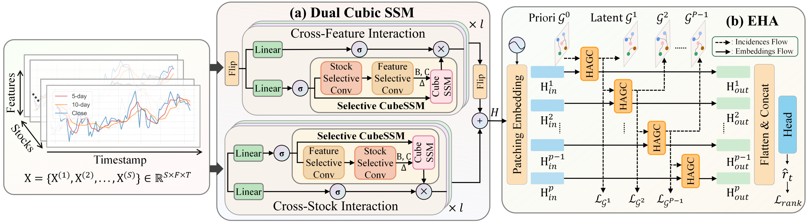
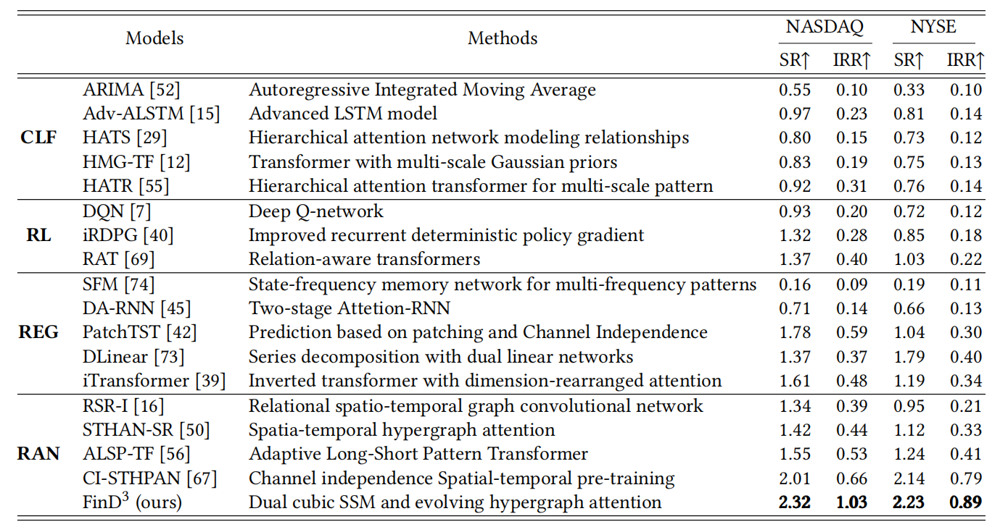

# FinD3: A Dual 3D State Space Model with Dynamic Hypergraph for Financial Stock Prediction

This repository contains the code and resources supporting our CIKM 2025 paper:
https://dl.acm.org/doi/10.1145/3746252.3761239

Overview
--------
FinD3 implements a Dual 3D State Space model augmented with a dynamic hypergraph for financial stock prediction. This repo provides the code, data provider utilities, model definitions, experiment entrypoints and visualization tools used to run experiments and reproduce results from the paper.

### Motivation
**Figure 1.** Limitations of UTS/MTS: UTS ignores cross-stock & cross-feature signals; MTS captures only one. FinD3 targets full 3D-MTS dependencies for sharper forecasts.

### Model Architecture
**Figure 2.** FinD3 overview. DCSSM (left) scans 3D-MTS in dual cubic branches; EHA (right) evolves a domain-aware hypergraph stage-by-stage for dynamic market structure.

### Experiement Performence
**Figure 3.** NASDAQ & NYSE test 2017. FinD3 leads in IRR (≥ 1.0) and SR (≥ 2.2) while keeping inference < 22 s, validating both accuracy and speed.



Repository structure
--------
- .gitignore               — Git ignore rules
- Readme.md                — (this proposed README)
- requirements.txt         — Python dependencies
- run.py                   — main entrypoint for training / evaluation / inference
- data_provider/           — data loading, preprocessing, dataset wrappers
- exp/                     — experiment configurations, example experiment scripts or config files
- layers/                  — custom neural network layers and building blocks
- models/                  — model definitions (FinD3 and any baselines)
- scripts/                 — helper scripts for data download/preparation and automation
- utils/                   — utility functions (metrics, logging, helpers)
- visualization/           — plotting and result-analysis tools

Quick start
--------
1. Clone the repository
   ```bash
   git clone https://github.com/decisionintelligence/FinD3.git
   cd FinD3
   ```

2. Create a virtual environment and install dependencies
   ```bash
   python -m venv .venv
   source .venv/bin/activate    # macOS / Linux
   # .venv\Scripts\activate     # Windows
   pip install -r requirements.txt
   ```
   
3. Prepare data
   - Dataset is followed https://github.com/fulifeng/Temporal_Relational_Stock_Ranking

5. Example: training / evaluation / inference
   - run.py is the primary entrypoint:
     ```bash
     python run.py
     ```
   - or use the provided script:
     ```bash
     bash ./scripts/run_experiment.sh
     ```

Citation
--------
If you use this code, please cite the CIKM 2025 paper:

FinD3: A Dual 3D State Space Model with Dynamic Hypergraph for Financial Stock Prediction  
https://dl.acm.org/doi/10.1145/3746252.3761239

Example BibTeX:

```
@inproceedings{mei2025FinD3,
  title={FinD${}^3$: A Dual 3D State Space Model with Dynamic Hypergraph for Financial Stock Prediction},
  author={Mei, Jieyuan and Tian, Jindong and Xu, Ronghui and Wei, Hanyue and Guo, Chenjuan and Yang, Bin},
  booktitle={Proceedings of the 34th ACM International Conference on Information and Knowledge Management},
  year={2025}
}
```

Notes and disclaimers
--------
- Data licensing and privacy: follow the license/terms for each dataset. This repository generally contains code and utilities but not raw datasets.
- Reproducibility: check exp/ for seeds and hyperparameters. Minor differences can occur due to hardware, library versions, or nondeterminism — pin versions where needed.
- If any directory or script referenced above is missing or you prefer a different layout, tell me and I will adjust the README accordingly.

Contributing
--------
Issues and pull requests are welcome. If you contribute experimental results or configuration changes, please include exact commands, environment details, and seed values so others can reproduce your runs.

License
--------
Check the LICENSE file in this repository for the exact license terms. If none is present and you want a license added (e.g., MIT), I can propose one.
